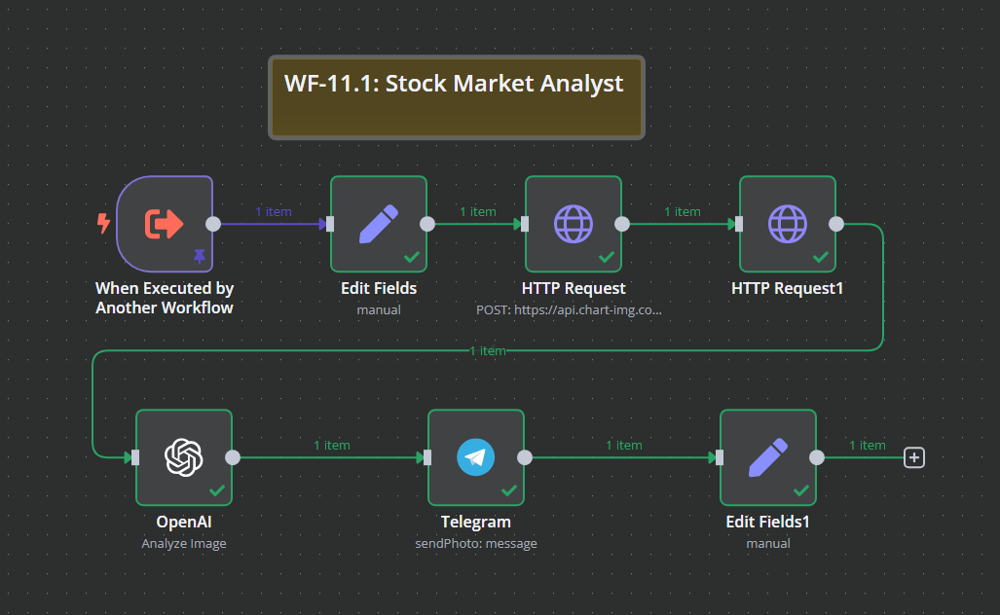
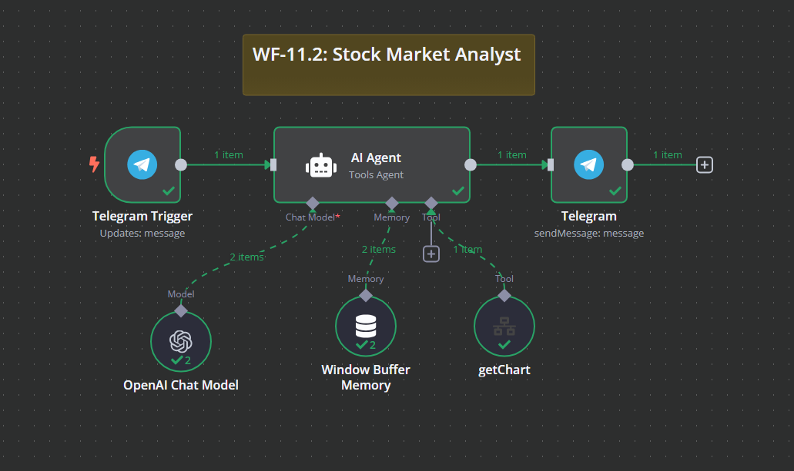

# WF-11: Stock Market Analyst – n8n Workflow Suite

## 📌 Overview
The **Stock Market Analyst** workflow suite consists of two interconnected **n8n workflows**, `WF-11.1` and `WF-11.2`, designed to provide AI-powered stock analysis. This system fetches real-time stock charts, analyzes them using AI, and delivers insights to users via a Telegram chatbot.

### 📊 **Workflow Structure**
- `WF-11.2` acts as the **Telegram-based AI Assistant**, responding to user queries.
- `WF-11.1` is triggered when technical stock analysis is requested, fetching real-time stock charts and generating AI-powered insights.

## 🔧 Workflow Components
### 🏗️ **WF-11.2: Telegram Stock Market Chatbot**
1. **💬 Telegram Trigger** – Detects stock-related queries from users.
2. **🤖 AI Agent** – Engages in conversation, answering financial questions and analyzing stock market trends.
3. **📊 GetChart Tool** – Calls `WF-11.1` to retrieve stock chart images and analysis.
4. **💾 Window Buffer Memory** – Maintains chat history for better AI responses.
5. **📡 Telegram Response** – Sends AI-generated stock insights back to the user.

### 🏗️ **WF-11.1: Stock Market Chart Analyzer**
1. **🚀 Workflow Trigger** – Activated by `WF-11.2` when a user requests stock analysis.
2. **📩 Input Processor** – Extracts the stock ticker symbol from the request.
3. **🌐 HTTP Request (Chart API)** – Fetches a **real-time stock chart** from an external trading API.
4. **📝 AI-Based Chart Analysis** – Uses OpenAI to analyze trends, support/resistance levels, and key indicators.
5. **📡 Telegram Notification** – Sends the generated chart and AI analysis back to the Telegram chat.

## ⚙️ How It Works
1. 💬 A user sends a stock-related query in **Telegram** (e.g., "Can you analyze AAPL?").
2. 🤖 The **AI Agent** in `WF-11.2` identifies the request and, if a stock ticker is provided, calls `WF-11.1`.
3. 📊 **WF-11.1** fetches the stock chart, performs AI-driven technical analysis, and generates insights.
4. 📡 The **Telegram bot** in `WF-11.2` delivers the chart and analysis back to the user.

## 📷 Workflow Screenshot

## 🚀 Setup Instructions
- 📥 **Import both workflows** (`WF-11.1` and `WF-11.2`) into `n8n`.
- 🔑 **Ensure API credentials** for OpenAI, Telegram, and the stock chart API are configured.
- ✅ **Activate both workflows** to enable stock analysis via Telegram.

## 📝 Notes
- ⚠️ The workflows are **inactive by default**.
- 🛠️ Modify AI prompts and stock chart API settings to fit your specific needs.
- 📢 The AI **does not provide financial advice**—it offers technical insights based on historical data.
